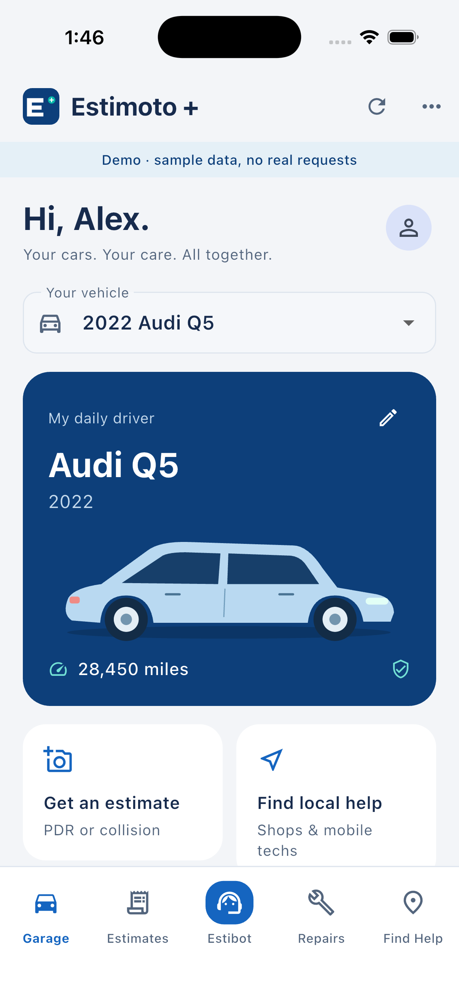

# Estimoto +

The customer companion to Estimoto. A separate mobile app for a saved garage, PDR/Collision estimates, repair updates and finding the right shop or technician.

This repository contains the first working app and customer API milestone. It is not connected to the production Estimoto database or published to the app stores. See [release status](docs/release-status.md) for verified behavior and remaining integration work.

[Download the signed Android demo beta](https://github.com/JamesMcDaniel04/Estimoto-/releases/download/v0.1.0-beta.1/estimoto-plus-0.1.0-1.apk) · [Mobile/TestFlight setup status](docs/mobile-release.md)



## Explore the app

Install Flutter 3.44.1, then:

```sh
cd app
flutter pub get --enforce-lockfile
flutter run --dart-define=PLUS_DEMO=true
```

Select an iOS simulator, Android device or Chrome. The explicit demo has fictional vehicles, providers and timelines; changes reset when it reloads and no provider is contacted. To serve a static preview:

```sh
cd app
flutter build web --dart-define=PLUS_DEMO=true
python3 -m http.server 4318 --bind 127.0.0.1 --directory build/web
```

Open `http://127.0.0.1:4318`. Production customer sessions use the dedicated authenticated API; network errors never fall back to sample data.

## What is in this milestone

| Area | Implemented |
| --- | --- |
| Garage | Saved contact details, multiple vehicles, mileage and optional insurance; date/mileage reminders |
| Estimates | PDR/Collision tabs, draft creation using a saved car, private photo upload and trusted estimate history |
| Repairs | Shop-supplied timelines and update dates, request delivery/response status, cancellation |
| Find Help | Opt-in shops and technicians filtered by service ZIP, specialty and mobile service; maps for published addresses |
| Estibot | Common-care guidance, structured matching, missing-detail prompts, a reviewed request flow and labeled YouTube search links |
| Foundation | Separate `io.estimoto.plus` iOS/Android app, Supabase Auth client, customer ownership checks, migrations, durable request outbox and bridge contract |

Submitting a service request is not an appointment. A provider must confirm acceptance and schedule. Estibot presents a review screen before sharing contact and vehicle details.

## Run the API and checks

Use Python 3.13:

```sh
cd backend
python3 -m venv .venv
.venv/bin/pip install -r requirements.lock
```

Follow [backend configuration](backend/README.md) to start a persistent local service and [app configuration](app/README.md) to connect a device. All local configuration, tokens, databases and photo files stay outside version control. The app uses a publishable Auth key; bridge/server keys remain on the server.

From the repository root:

```sh
(cd backend && .venv/bin/python -m pytest -q)
(cd app && flutter analyze && flutter test)
backend/.venv/bin/python scripts/smoke_api.py --flutter-client
```

The socket smoke creates a temporary migrated database and a local fictional identity/provider server, exercises customer isolation and the Dart HTTP client, then restarts the API to verify persistence. It cleans up its temporary files and makes no production calls.

## Next integration work

Connect opted-in Estimoto providers and customer-linked estimate/repair records through the [bridge contract](docs/api-contract.md), finish native guided capture and estimator submission, enable verified sign-in/push, and add model-backed Estibot and verified video retrieval. CARFAX is an optional separate partner integration; this milestone does not invent service history or advertise it as connected. Store branding, signing and distribution follow device validation.

[Product design](docs/superpowers/specs/2026-09-13-estimoto-plus-design.md) · [Implementation plan](docs/superpowers/plans/2026-09-13-estimoto-plus-foundation.md)
